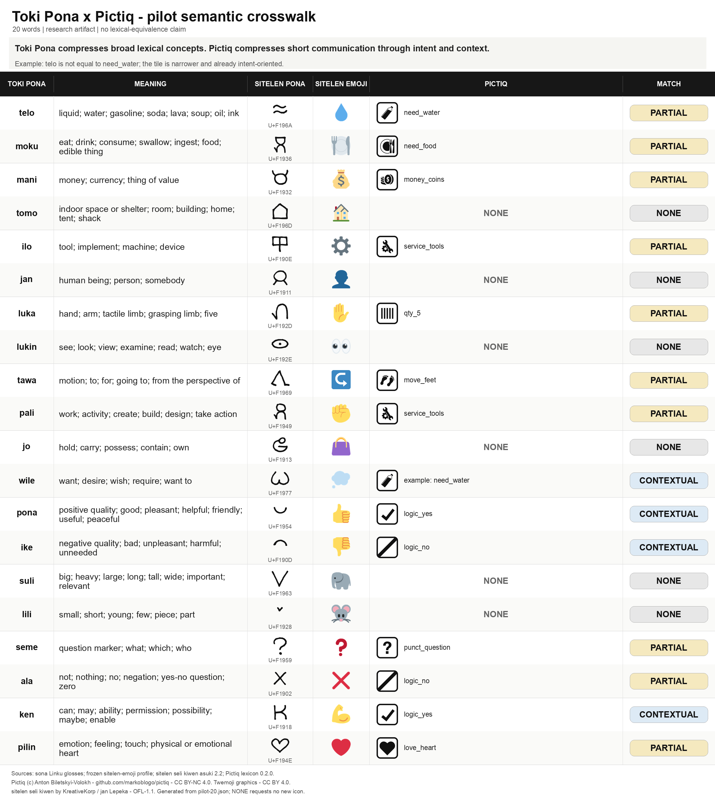

# Toki Pona x Pictiq: 20-word pilot

> **Research artifact.** This crosswalk tests useful semantic overlap. It does not claim that Toki Pona words, sitelen pona glyphs, sitelen emoji, and Pictiq tiles are equivalent.

> Toki Pona primarily compresses vocabulary by allowing broad lexical concepts.
> Pictiq often compresses communication by relying on context and communicative intent.

For example, `telo` covers water and many other liquids. Pictiq `need_water` is narrower and already carries practical intent. Therefore `telo != need_water`, even when it is the best current mapping.



Printable version: [pilot-20-grid.pdf](pilot-20-grid.pdf)

## Sources inspected before editing

- Toki Pona vocabulary membership: `packages/sitelen-emoji/words/nimi_pu.txt`.
- Display-layer recognition lexicon: `packages/sitelen-layer-plugin/src/tokiPonaLexicon.ts` (139 words, including community additions); the pilot uses the 120-word list above.
- sitelen pona mechanism: `packages/sitelen-layer-plugin/sitelen-pona-font.css` and `assets/fonts/sitelen-seli-kiwen-asuki.ttf`; Latin words shape into ligatures.
- sitelen emoji source of truth: `packages/sitelen-emoji/profiles/default-stable.v1.json`; consumer copies are generated from this frozen profile.
- English glosses: `lipu-linku/sona` `words/source/definition.toml` pinned to commit `c2c56d2769b369af89c6c239d45aa616ba6d7b77`.
- Pictiq registry and assets: `lexicon/icon-index.json` and `icons/svg/{id}.svg` at commit `7e9663d5a1236a881faf6a030e3258cf99e74a73`.
- Pictiq packs: `packs/universal-core.json`, `packs/universal-v1.json`, and contextual packs. No pack or core file was changed.

The source snapshots and SHA-256 values are recorded in [`pilot-20.json`](pilot-20.json).

## Pilot crosswalk

| Toki Pona | Meaning | sitelen pona | sitelen emoji | Pictiq | Mapping | Notes |
|---|---|---|---|---|---|---|
| `telo` | liquid; water; gasoline; soda; lava; soup; oil; ink | ligature `telo` -> `U+F196A` | 💧 | [`need_water`](https://github.com/markoblogo/pictiq/blob/7e9663d5a1236a881faf6a030e3258cf99e74a73/icons/svg/need_water.svg) | **PARTIAL** | need_water is water/drink with practical intent; telo also covers many other liquids. |
| `moku` | eat; drink; consume; swallow; ingest; food; edible thing | ligature `moku` -> `U+F1936` | 🍽️ | [`need_food`](https://github.com/markoblogo/pictiq/blob/7e9663d5a1236a881faf6a030e3258cf99e74a73/icons/svg/need_food.svg) | **PARTIAL** | need_food expresses food or hunger; moku also acts as eat, drink, and consume. |
| `mani` | money; currency; thing of value | ligature `mani` -> `U+F1932` | 💰 | [`money_coins`](https://github.com/markoblogo/pictiq/blob/7e9663d5a1236a881faf6a030e3258cf99e74a73/icons/svg/money_coins.svg) | **PARTIAL** | money_coins means cash/pay cash and is narrower than money, wealth, or property. |
| `tomo` | indoor space or shelter; room; building; home; tent; shack | ligature `tomo` -> `U+F196D` | 🏠 | **NONE** | **NONE** | Pictiq has specific places such as hotel and shop, but no generic building or home. |
| `ilo` | tool; implement; machine; device | ligature `ilo` -> `U+F190E` | ⚙️ | [`service_tools`](https://github.com/markoblogo/pictiq/blob/7e9663d5a1236a881faf6a030e3258cf99e74a73/icons/svg/service_tools.svg) | **PARTIAL** | service_tools covers tools and repair, not the wider class of devices and machines. |
| `jan` | human being; person; somebody | ligature `jan` -> `U+F1911` | 👤 | **NONE** | **NONE** | The current lexicon has no generic person tile. |
| `luka` | hand; arm; tactile limb; grasping limb; five | ligature `luka` -> `U+F192D` | ✋ | [`qty_5`](https://github.com/markoblogo/pictiq/blob/7e9663d5a1236a881faf6a030e3258cf99e74a73/icons/svg/qty_5.svg) | **PARTIAL** | qty_5 covers only the numerical use; it says nothing about hand or arm. |
| `lukin` | see; look; view; examine; read; watch; eye | ligature `lukin` -> `U+F192E` | 👀 | **NONE** | **NONE** | No current Pictiq tile encodes looking, seeing, or an eye. |
| `tawa` | motion; to; for; going to; from the perspective of | ligature `tawa` -> `U+F1969` | ↪️ | [`move_feet`](https://github.com/markoblogo/pictiq/blob/7e9663d5a1236a881faf6a030e3258cf99e74a73/icons/svg/move_feet.svg) | **PARTIAL** | move_feet covers walking or going on foot, not direction, benefit, or viewpoint. |
| `pali` | work; activity; create; build; design; take action | ligature `pali` -> `U+F1949` | ✊ | [`service_tools`](https://github.com/markoblogo/pictiq/blob/7e9663d5a1236a881faf6a030e3258cf99e74a73/icons/svg/service_tools.svg) | **PARTIAL** | service_tools overlaps with repair work but does not represent general doing or making. |
| `jo` | hold; carry; possess; contain; own | ligature `jo` -> `U+F1913` | 👜 | **NONE** | **NONE** | The current protocol has no generic possession or containment relation. |
| `wile` | want; desire; wish; require; want to | ligature `wile` -> `U+F1977` | 💭 | example: [`need_water`](https://github.com/markoblogo/pictiq/blob/7e9663d5a1236a881faf6a030e3258cf99e74a73/icons/svg/need_water.svg) | **CONTEXTUAL** | A concrete need tile is only an example of need-intent in context; it is not a lexical mapping for wile. |
| `pona` | positive quality; good; pleasant; helpful; friendly; useful; peaceful | ligature `pona` -> `U+F1954` | 👍 | [`logic_yes`](https://github.com/markoblogo/pictiq/blob/7e9663d5a1236a881faf6a030e3258cf99e74a73/icons/svg/logic_yes.svg) | **CONTEXTUAL** | logic_yes can signal approval or OK; it does not lexicalize positive quality or usefulness. |
| `ike` | negative quality; bad; unpleasant; harmful; unneeded | ligature `ike` -> `U+F190D` | 👎 | [`logic_no`](https://github.com/markoblogo/pictiq/blob/7e9663d5a1236a881faf6a030e3258cf99e74a73/icons/svg/logic_no.svg) | **CONTEXTUAL** | logic_no can reject something in context; it does not mean a bad, harmful, or unneeded quality. |
| `suli` | big; heavy; large; long; tall; wide; important; relevant | ligature `suli` -> `U+F1963` | 🐘 | **NONE** | **NONE** | qty_plus means more, not generic physical size, length, or importance. |
| `lili` | small; short; young; few; piece; part | ligature `lili` -> `U+F1928` | 🐭 | **NONE** | **NONE** | qty_minus means less, not generic smallness, youth, or a small quantity. |
| `seme` | question marker; what; which; who | ligature `seme` -> `U+F1959` | ❓ | [`punct_question`](https://github.com/markoblogo/pictiq/blob/7e9663d5a1236a881faf6a030e3258cf99e74a73/icons/svg/punct_question.svg) | **PARTIAL** | punct_question marks a question but does not encode the unknown argument carried by seme. |
| `ala` | not; nothing; no; negation; yes-no question; zero | ligature `ala` -> `U+F1902` | ❌ | [`logic_no`](https://github.com/markoblogo/pictiq/blob/7e9663d5a1236a881faf6a030e3258cf99e74a73/icons/svg/logic_no.svg) | **PARTIAL** | logic_no covers no/not, but ala also expresses nothing, zero, absence, and question formation. |
| `ken` | can; may; ability; permission; possibility; maybe; enable | ligature `ken` -> `U+F1918` | 💪 | [`logic_yes`](https://github.com/markoblogo/pictiq/blob/7e9663d5a1236a881faf6a030e3258cf99e74a73/icons/svg/logic_yes.svg) | **CONTEXTUAL** | logic_yes can answer a can-I question affirmatively; it does not encode ability or possibility. |
| `pilin` | emotion; feeling; touch; physical or emotional heart | ligature `pilin` -> `U+F194E` | ❤️ | [`love_heart`](https://github.com/markoblogo/pictiq/blob/7e9663d5a1236a881faf6a030e3258cf99e74a73/icons/svg/love_heart.svg) | **PARTIAL** | love_heart covers affection or romance, only a narrow subset of feeling and sensation. |

## Result

DIRECT **0** | PARTIAL **10** | COMPOSED **0** | CONTEXTUAL **4** | NONE **6**

No row required a defensible multi-tile composition. `COMPOSED = 0` is a pilot result; the schema still supports multiple ordered Pictiq IDs.

## Gap analysis

A Toki Pona gap becomes a Pictiq candidate only when the concept is independently useful for Pictiq outside this crosswalk.

| Word | Possible Pictiq concept | Recommendation | Reason |
|---|---|---|---|
| `jan` | generic person | **Strong Candidate** | People are independently frequent participants in short messages and pointing interactions. |
| `tomo` | generic building/home (review split later) | **Strong Candidate** | A generic destination or shelter is useful beyond the crosswalk; later review should decide whether building and home need separate concepts. |
| `lukin` | look, see, or eye | **Possible Candidate** | Useful for attention and observation, but the intended communicative act needs user testing. |
| `jo` | have or contain | **Not Justified** | It is an abstract relation whose visual reading would depend heavily on operands and grammar. |
| `suli` | large or important modifier | **Possible Candidate** | Physical size can be useful, but importance should not be folded into the same tile. |
| `lili` | small or little modifier | **Possible Candidate** | Physical smallness may be useful, but youth and few require different context and qty_minus already covers less. |

The strongest current candidates are a **generic person** and a **generic building/home**. Both occur independently in short cross-language messages. They still require Pictiq user testing and design review before icon work.

This pilot does not justify new generic tiles for `jo`, `wile`, `pona`, `ike`, or `ken`. Their abstract or evaluative readings depend on grammar and context. Toki Pona's bundled polysemy in `suli`, `lili`, and `luka` must also not be copied into single Pictiq icons.

## Licensing and provenance

- **Toki Pona vocabulary:** the repository's 120-word `nimi_pu.txt` validates membership. English source definitions come from the pinned `sona Linku` dataset; the shorter display glosses are adaptations under CC BY-SA 4.0.
- **sitelen pona:** `sitelen seli kiwen asuki` v2.2 by KreativeKorp / jan Lepeka, bundled under SIL OFL 1.1. The grid renders the actual OpenType ligatures; it does not copy the font into Pictiq.
- **sitelen emoji:** the canonical frozen profile identifies Dev Bali's BSD-3-Clause `desktop-sitelen-emoji` mapping as its upstream source. [`THIRD_PARTY_NOTICES.md`](THIRD_PARTY_NOTICES.md) now preserves its copyright, license conditions, disclaimer, source URL, and reuse description.
- **Emoji artwork:** the grid uses Twemoji 17.0.0 artwork under CC BY 4.0 to render the profile's exact Unicode sequences consistently.
- **Pictiq:** canonical SVG icons are CC BY-NC 4.0. The generated grid embeds those tiles, so its Pictiq-derived visual content remains non-commercial unless separately licensed.

## Suitability for scaling

The schema is suitable for the full vocabulary because it keeps representation sources, ordered Pictiq IDs, mapping class, context dependence, semantic caveats, and pinned English definitions separate. Scaling should wait for review of the class boundaries and the six NONE decisions, and should test at least a few genuine COMPOSED cases.

Unresolved semantic issues:

- `ala` is PARTIAL: `logic_no` covers no/not, while nothing, zero, absence, and question formation remain uncovered.
- `wile` displays `example: need_water` as one concrete need-intent tile plus context; it is not a lexical mapping for `wile` alone.
- `pona`, `ike`, and `ken` map to response/logic tiles only in situations that supply the missing predicate.
- `suli` and `lili` bundle size, degree, age, and evaluation in ways a Pictiq modifier should not inherit.

## Draft cross-repository links (not applied)

Suggested Pictiq README wording:

```markdown
### Related projects

Toki Pona Translator explores a deliberately minimal constructed language and its visual writing systems.

Pictiq approaches a related problem from a different direction: a constrained visual protocol for short messages.

https://github.com/markoblogo/toki-pona-translator
```

Suggested Toki Pona README wording:

```markdown
### Related experiments

Pictiq is a minimal visual protocol for short messages across language barriers.

The Pictiq ↔ Toki Pona crosswalk explores how Toki Pona concepts correspond to a constrained intent-oriented visual system.

https://github.com/markoblogo/pictiq
```

## Reproduce and validate

From the Toki Pona repository root:

```bash
python3 crosswalks/pictiq/generate_pilot.py --pictiq-root /path/to/pictiq --validate-only
python3 crosswalks/pictiq/generate_pilot.py --pictiq-root /path/to/pictiq
```

Rendering requires Pillow with libraqm, HarfBuzz (`hb-shape`), an SVG renderer (`rsvg-convert` or macOS Quick Look), and network access to the pinned Twemoji 17.0.0 assets. Validation itself uses only Python and repository files; HarfBuzz adds exact ligature verification when installed.
